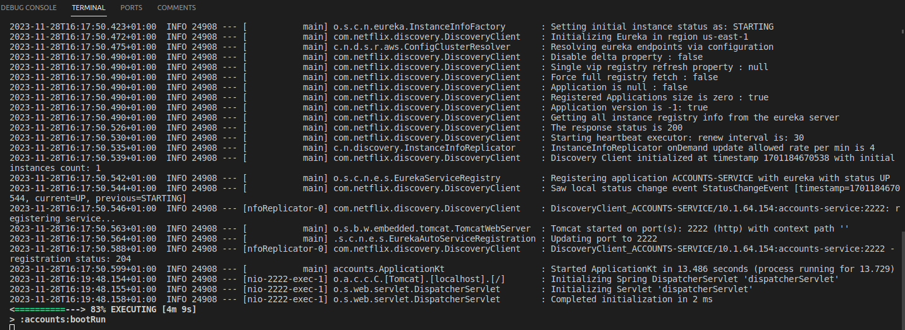
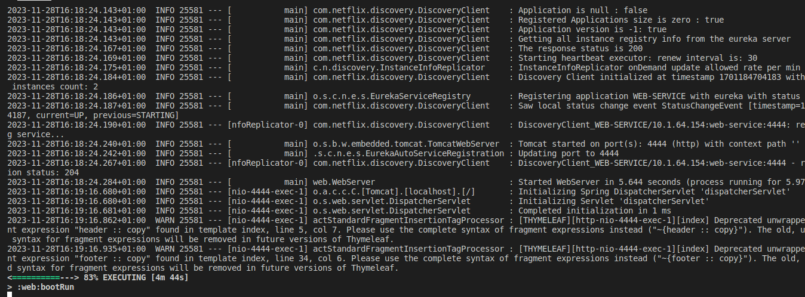
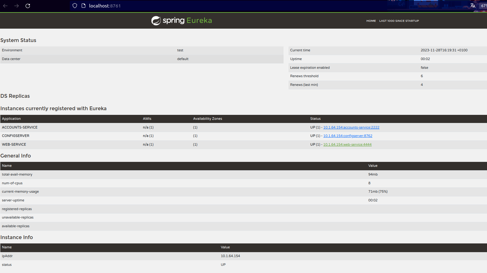
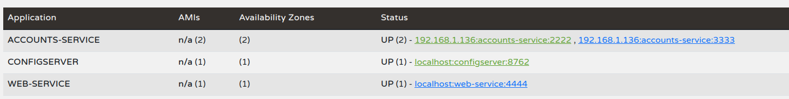
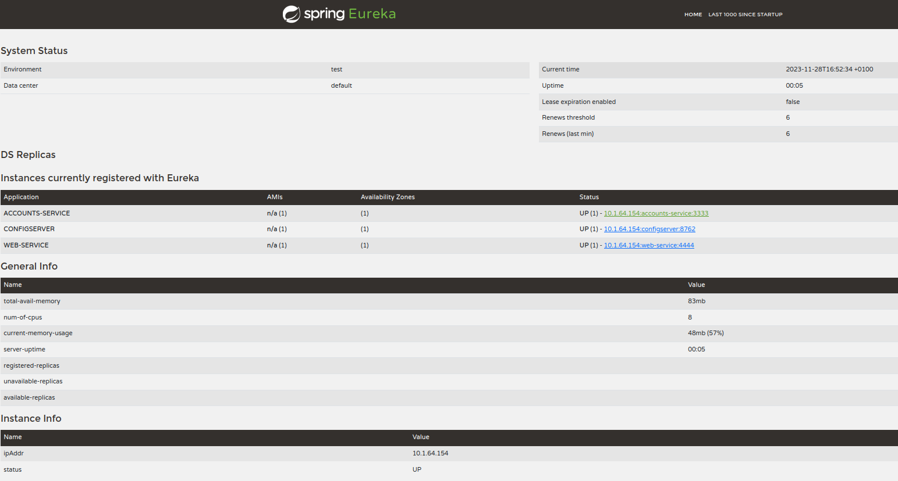
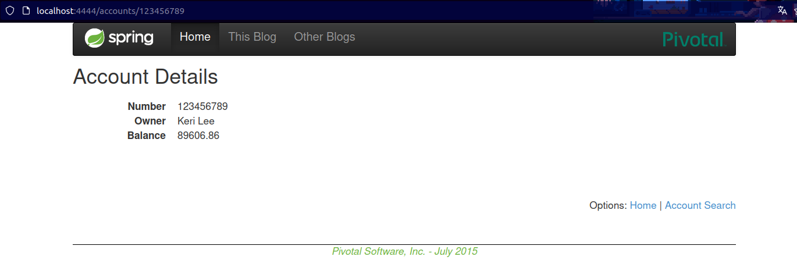

# Microservices Configuration and Discovery Report

## 1. Setting up Configuration Repository

- A configuration repository has been created, and the URI is as follows: https://github.com/Loretix/lab6-microservices-config-repo.git.

## 2. Running and Registering Services

- Below are the screenshots of the running services registered in Eureka.
    - 
    - 

## 3. Updating Configuration for Accounts Service

- Despite having changed the configuration of the accounts server, indicating a port change, this change will not take effect until the service is restarted. As seen in the image, right after starting the server, we observe that 'accounts' is still on port 2222, and also, the Eureka dashboard shows the information of the web service on port 4444.

    - 

## 4. Running a Second Instance of the Accounts Service

- If we run a second instance of the accounts service, we will be able to see a new instance of the accounts service on the Eureka dashboard
on port 3333.
    - 

## 5. Killing the Service Accounts (2222) and Requesting Web

- If we kill the accounts server on port 2222 we will be able to see the port change, when we stop the accounts service, the web server that was linked to the accounts server on port 2222 will stop working for a while, and then it will try to connect to the other accounts service available on port 3333.

    - 

## 6. Web Service Providing Information about Accounts Again

- Here we can see that the web service is providing information about the accounts again, but this time it is the accounts service on port 3333.

    - 
